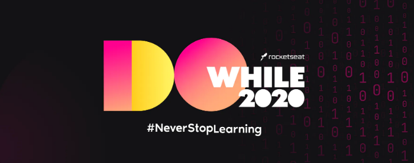

<!-- Badges session -->
<p align="center">
  <!-- languages -->
  
  <!-- repo size -->
  
  <!-- last commit -->
  
  <!-- licence MIT -->
  
</p>


<!--Banner session-->
<p align="center"></p>

<!--About session-->
<h1 align="center">Interfaces futurísticas com Next.js, TailwindCSS e Framer Motion<br>🚀 Do While 2020 - Rocketseat🚀</h1>

Vamos criar interfaces modernas mantendo a produtividade. Com uma incrível experiência de desenvolvimento, construiremos interfaces completas com TailwindCSS, criaremos páginas animadas com Next.js e Framer Motion. Abordaremos responsividade (Mobile First) e transições entre as rotas da aplicação!

Digite para executar o projeto
```
yarn dev
```

- [O Projeto](https://interfaces-next.vercel.app/)

<p align="center"></p>
<p align="center"></p>
 
<!--License session-->
<h3>📝 Licença</h3>

Este projeto está sob a licença [MIT](./LICENSE).

<!--Bottom session-->
<br><h4 align=center>Made with by <a target="_blank" href="https://pleiterson.vercel.app" >Pleiterson Amorim</a></h4>